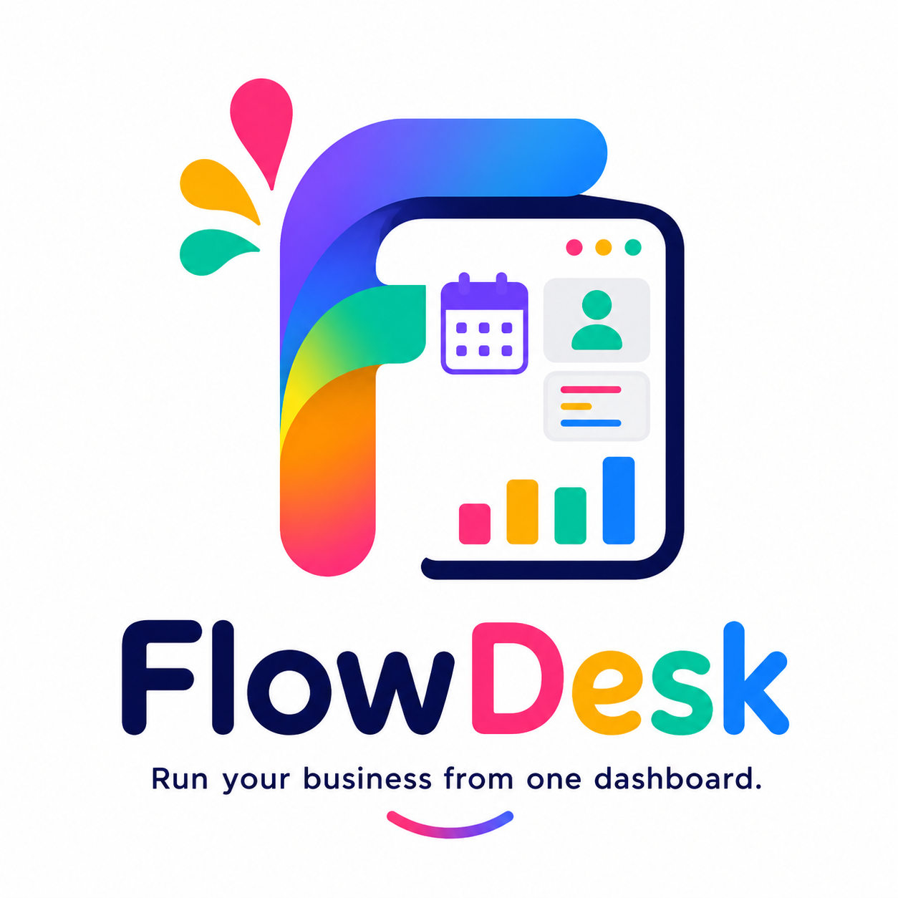

<p align="center">
  
</p>

<h1 align="center">FlowDesk</h1>

<p align="center">
  <strong>Run your business from one dashboard.</strong>
</p>

<p align="center">
  A modern SaaS business management platform designed to help service-based businesses manage customers, staff, services, bookings, and daily operations from one intuitive dashboard.
</p>

---

## 📖 About

FlowDesk is a personal full-stack web application created to showcase modern software development practices while solving real-world business problems.

The goal is to provide an all-in-one management platform for service-based businesses such as salons, barbers, mechanics, tutors, photographers, cleaners, electricians, plumbers, and many more.

Instead of juggling spreadsheets, calendars, messaging apps, and paperwork, businesses can manage everything from a single dashboard.

---

## ✨ Vision

FlowDesk aims to become an operating system for small businesses by providing the tools they need to manage and grow their business in one place.

---

## 🚀 Planned Features

### 👤 Authentication
- User registration
- Login & logout
- Password reset
- Email verification
- Role-based access control

### 🏢 Business Management
- Business profile
- Logo upload
- Business hours
- Contact information
- Multiple business locations (future)

### 👥 Customer Management
- Customer profiles
- Search & filtering
- Customer history
- Notes
- Loyalty tracking (future)

### 👨‍💼 Staff Management
- Add & manage employees
- Working hours
- Roles & permissions
- Availability
- Performance overview (future)

### 📅 Booking System
- Online appointment booking
- Booking approval
- Rescheduling
- Cancellations
- Calendar view
- Appointment reminders

### 🛠 Services
- Create and manage services
- Pricing
- Duration
- Categories

### 📊 Dashboard
- Daily overview
- Upcoming appointments
- Revenue overview
- Customer statistics
- Staff statistics
- Business insights

### 📈 Reports & Analytics
- Booking reports
- Customer reports
- Revenue reports
- Popular services
- Business growth analytics

### 🔔 Notifications
- Email notifications
- Booking confirmations
- Appointment reminders
- Password reset emails

### ⚙️ Future Features
- AI Business Assistant
- WhatsApp notifications
- Online payments
- Inventory management
- Invoicing
- Expense tracking
- Website generator
- Mobile application

---

## 🛠 Tech Stack

### Frontend
- HTML5
- CSS3
- JavaScript

### Backend
- Java
- Spring Boot
- Spring Security
- REST API

### Database
- PostgreSQL

### Tools
- IntelliJ IDEA
- Git
- GitHub
- Postman

---

## 📂 Project Structure

```
flowdesk/
│
├── frontend/
├── backend/
├── database/
├── docs/
├── images/
└── README.md
```

---

## 🎯 Project Goals

- Build a production-quality SaaS application.
- Apply clean architecture and best coding practices.
- Learn modern full-stack web development.
- Create a portfolio project that solves real business problems.
- Lay the foundation for a commercial software product.

---

## 📅 Development Roadmap

- [x] Project planning
- [x] Repository creation
- [x] Branding & logo
- [ ] UI/UX design
- [ ] Database design
- [ ] Backend development
- [ ] Frontend development
- [ ] Authentication
- [ ] Booking system
- [ ] Dashboard
- [ ] Deployment
- [ ] Version 1.0 Release

---


<p align="center">
Built by <strong>Nuyra Swanson</strong>
</p>
